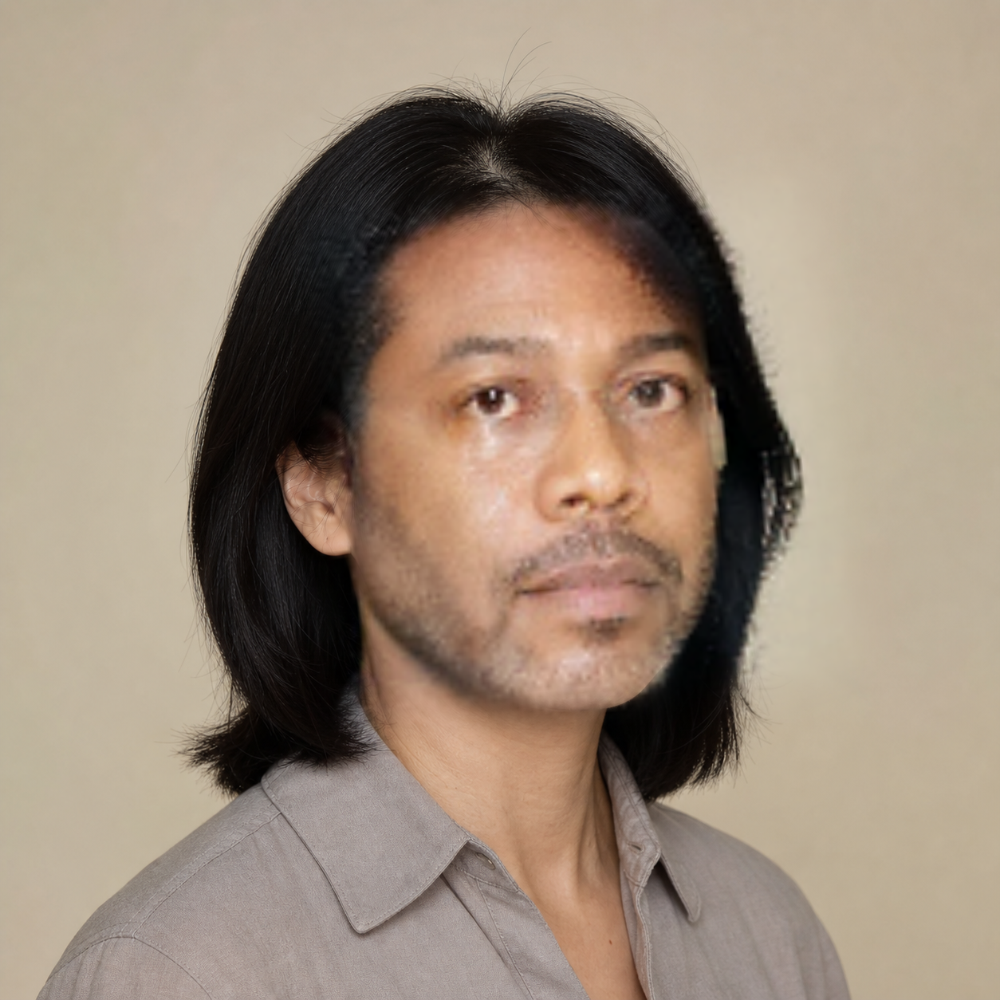
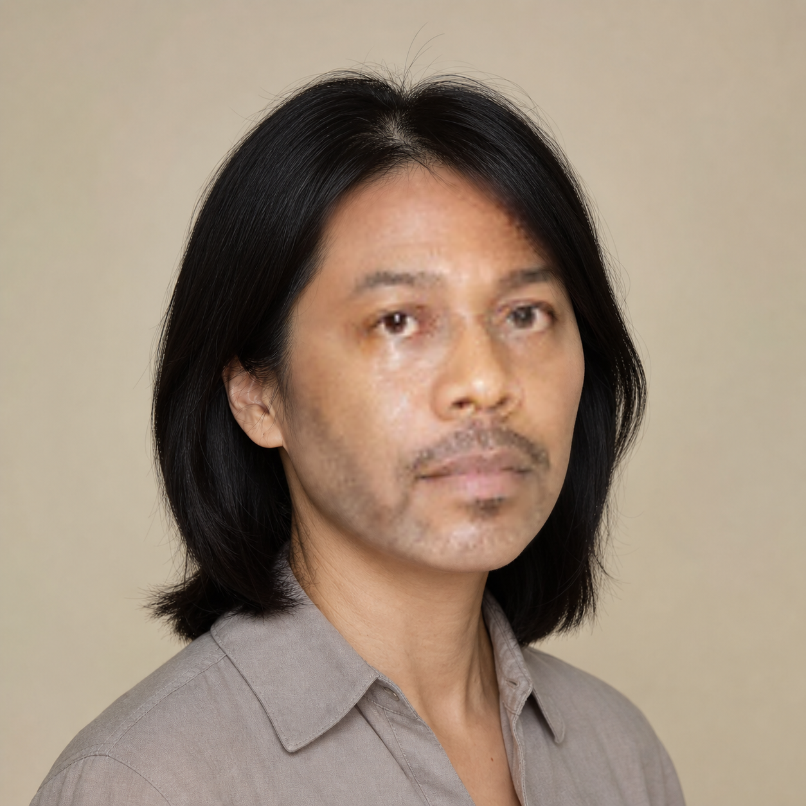
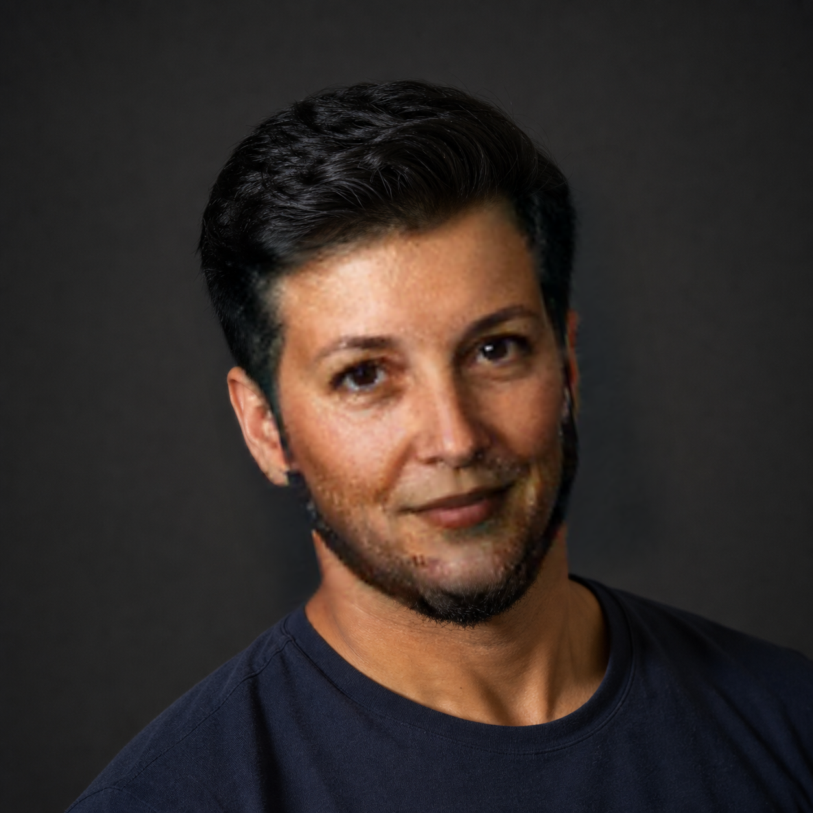
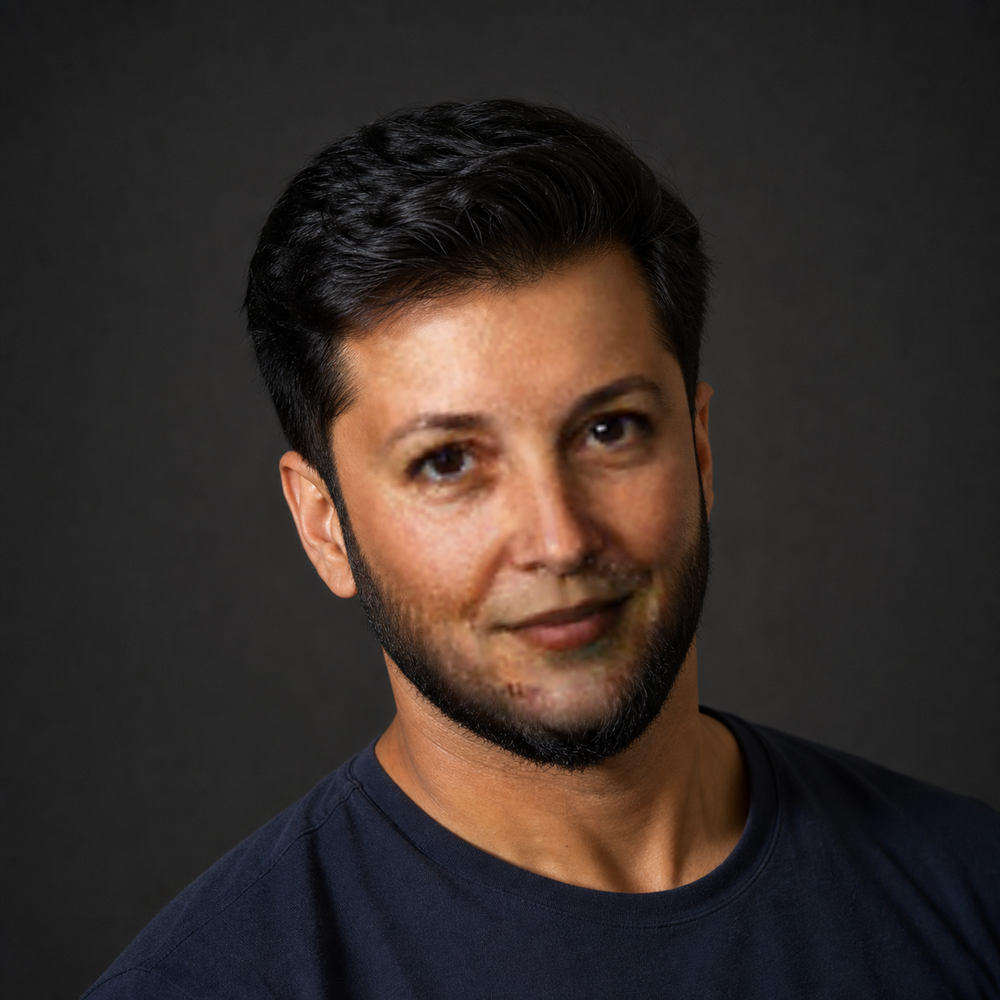

# Визуальный parity-чек-лист этапа C

Дата проверки: 21.07.2026. Сравнивались Android API 35 x86_64 CPU и canonical
FaceFusion 3.7.1 `face_swapper.swap_face` для трёх синтетических пар. Численная
parity и абсолютное качество отмечаются раздельно: одинаковый артефакт на обеих
сторонах не является мобильной регрессией, но остаётся ограничением качества.

| Проверка | `pair_01` | `pair_02` | `pair_03` |
| --- | --- | --- | --- |
| Android ↔ FaceFusion | OK, визуально неразличимы | OK, визуально неразличимы | OK, визуально неразличимы |
| Граница маски | Мягкая; прямоугольная граница не видна | Parity OK; на обеих сторонах заметен переход у верхнего лба/правой линии волос | Parity OK; на обеих сторонах заметны мягкие переходы у линии волос и нижней границы бороды |
| Оттенок кожи | Согласован с целевой сценой | Parity OK; на обеих сторонах сохраняется отличие лица от шеи/виска | Parity OK; лицо местами светлее и теплее шеи из-за неоднородного света |
| Двоение черт | Не обнаружено | Не обнаружено | Не обнаружено |
| Глаза | Центрированы, геометрия цели сохранена | Поворот и направление взгляда цели сохранены | Поворот и направление взгляда цели сохранены |
| Рот/зубы | Рот цели сохранён; зубы не видны | Рот цели сохранён; зубы не видны | Рот цели сохранён; зубы не видны |
| Identity / поза | Identity источника узнаваема; фронтальная поза цели сохранена | Identity источника узнаваема; поза цели сохранена; очки источника не переносятся на обеих сторонах | Identity источника узнаваема, но частично скрывается бородой цели и мягкостью 128×128; поза/выражение цели сохранены |

Итог: parity финального кадра пройдена. Минимальный face-ROI SSIM — `0,997305`,
максимальный face-ROI MAE — `3,295332/255`, вне inverse ROI изменено 0 пикселей.
Граница и тон `pair_02`/`pair_03`, мягкость 128×128 и отсутствие fixture с видимыми
зубами зафиксированы как ограничения этапа C; исправление качества относится к
этапу E.

## E1, контрольная точка 2: parser-маска свапа

Дата проверки: 02.08.2026. Слева сохранён прежний box-only результат этапа C, справа —
production `PhotoPipeline` с эффективной маской `min(box, BiSeNet region)`. Для каждой
пары production-кадр побитово совпал с изолированным композитом того же raw crop;
цветовая статистика и `FaceColorAdjustment` между вариантами не менялись.

| Пара | До: box-mask | После: parser-mask |
| --- | --- | --- |
| `pair_02` |  |  |
| `pair_03` |  |  |

| Проверка | `pair_02` после parser | `pair_03` после parser |
| --- | --- | --- |
| Граница маски | Видимый переход box-mask у верхнего лба/правой линии волос устранён; волосы и висок цели сохранены | Переходы по линии волос и нижнему периметру бороды устранены; волосы и борода цели сохранены |
| Оттенок кожи | Отличие лица от шеи/виска остаётся; parser его не исправляет | Лицо остаётся светлее/теплее шеи при неоднородном свете |
| Двоение, глаза, рот | Новых артефактов и смещения не обнаружено | Новых артефактов и смещения не обнаружено |

Вывод: цель parser-маски достигнута — геометрический переход в волосы/висок/бороду
ушёл на обеих контрольных парах. Оставшийся дефект имеет цветовой характер; следующий
диагностический узел — color matching, а не расширение parser-mask. Сравнение проверяет
маску, но не заявляет финальную резкость 128×128 свапа.
